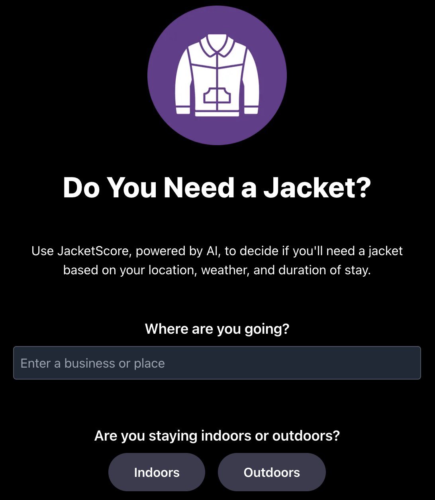
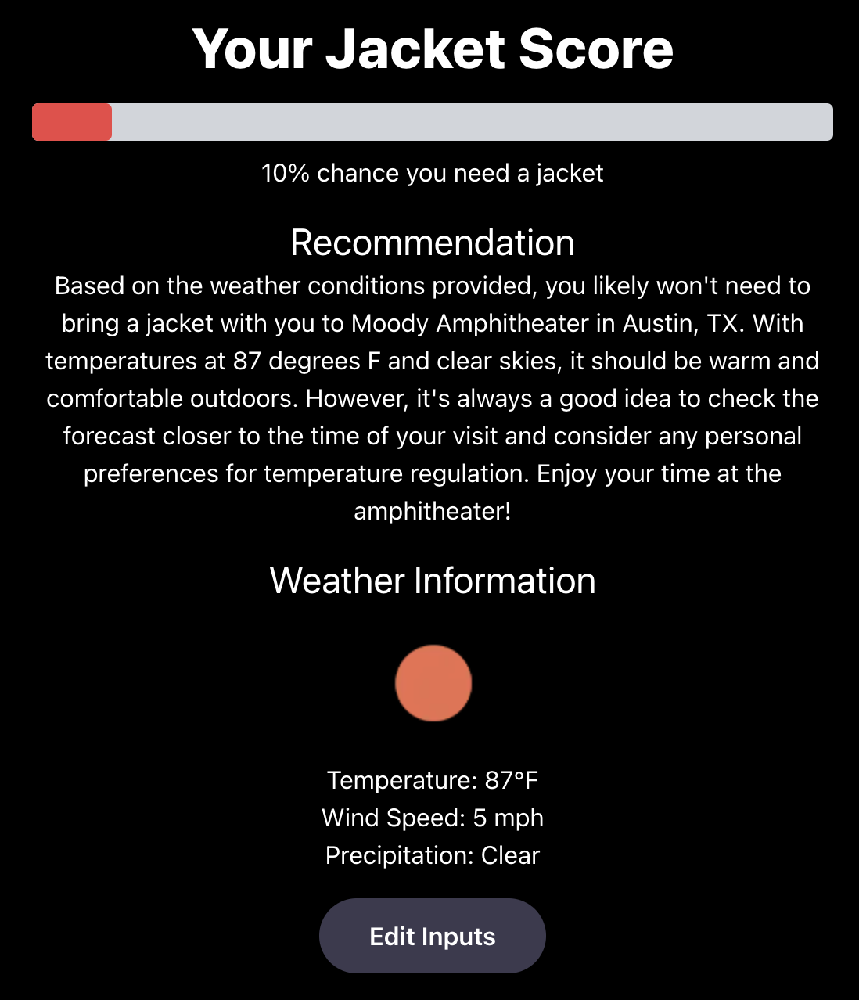

# JacketScore

**JacketScore** is a web app that helps users decide whether they need to bring a jacket based on personalized location, weather forecasts and event details utilizing AI.

## 🌟 Features

- **Location-Based Forecasts:** Search for any location using Google Places Autocomplete
- **Personalized Recommendations:** Get tailored advice based on gender, venue type, arrival time, and duration
- **AI Integration:** Leverages OpenAI’s ChatGPT to provide natural language recommendations
- **Weather Data:** Utilizes OpenWeather API for accurate and up-to-date forecasts
- **Responsive Design:** Built with Next.js and Tailwind CSS for a seamless experience on any device
- **Dark Mode Support:** Enjoy a user-friendly interface in both light and dark modes

## 🚀 Demo

Check out the live application at [jacketscore.com](https://jacketscore.com)

## 📸 Screenshots

## JacketScore Screenshots

<p align="center">
  <strong>Main Page</strong><br>
  
</p>

<p align="center">
  <strong>Results Page</strong><br>
  
</p>

## 🛠️ Installation & Setup

### **Prerequisites**

- Node.js (v14 or later)
- npm or yarn

### **Clone the Repository**

```bash
git clone https://github.com/yourusername/JacketScore.git
cd JacketScore
```

### **Install Dependencies**

```bash
npm install
# or
yarn install
```

### **Environment Variables**

Create a `.env.local` file in the root directory and add your API keys:

```bash
NEXT_PUBLIC_GOOGLE_API_KEY=your_google_api_key
OPENWEATHER_API_KEY=your_openweather_api_key
OPENAI_API_KEY=your_openai_api_key
GMAIL_USER=your_gmail_username
GMAIL_CLIENT_ID=your_gmail_client_id
GMAIL_CLIENT_SECRET=your_gmail_client_secret
GMAIL_REFRESH_TOKEN=your_gmail_refresh_token
```

**Note:** These keys are required for the app to function correctly. Ensure they are kept secret and not committed to version control.

### **Run the Development Server**

```bash
npm run dev
# or
yarn dev
```

Open [http://localhost:3000](http://localhost:3000) to view the app in the browser.

## 🧰 Technologies Used

- **Next.js:** React framework for server-side rendering and static site generation
- **React:** JavaScript library for building user interfaces
- **Tailwind CSS:** Utility-first CSS framework for styling
- **Google Places API:** For location search and autocomplete
- **OpenWeather API:** For fetching weather forecasts
- **OpenAI API:** For AI-generated recommendations
- **Nodemailer:** For handling email comment submissions via Gmail OAuth2

## 📡 APIs and Integration

### **Google Places API**

- Enables location search with autocomplete functionality
- Restricted API key for specific domains

### **OpenWeather API**

- Provides 5-day/3-hour weather forecasts
- Rounds temperature and wind speed to whole numbers for simplicity

### **OpenAI ChatGPT API**

- Considers user inputs like location, indoors/outdoors, arrival time, duration of stay, gender, and weather conditions based on location data
- Generates personalized jacket recommendations

### **Nodemailer with Gmail OAuth2**

- Handles comment submissions and sends email notifications
- Securely configured using OAuth2 credentials

## 🤖 How It Works

1. **User Inputs:**
   - Select location, venue type, arrival time, duration, and optionally, gender
2. **Weather Fetching:**
   - Retrieves weather data for the selected time and location
3. **AI Recommendation:**
   - Sends data to OpenAI API for a personalized recommendation
4. **Jacket Score Calculation:**
   - Calculates a score from 0-100% indicating the need for a jacket
5. **Results Display:**
   - Shows the jacket score, AI recommendation, and weather information

## 📁 Project Structure

Here's an overview of the project's file structure (excluding files and directories specified in `.gitignore`):

```
JacketScore/
├── public/
│   └── images/
│       ├── jacketscore-logo-full.png
│       └── jacketscore-logo.png
├── src/
│   ├── app/
│   │   ├── api/
│   │   │   ├── calculateJacketScore/
│   │   │   │   └── route.js
│   │   │   ├── getChatGPTRecommendation/
│   │   │   │   └── route.js
│   │   │   ├── getWeather/
│   │   │   │   └── route.js
│   │   │   └── submitComment/
│   │   │       └── route.js
│   │   ├── fonts/
│   │   │   ├── GeistMonoVF.woff
│   │   │   └── GeistVF.woff
│   │   ├── favicon.ico
│   │   ├── globals.css
│   │   ├── layout.js
│   │   └── page.js
│   └── components/
├── .eslintrc.json
├── .gitignore
├── jsconfig.json
├── next.config.mjs
├── package-lock.json
├── package.json
├── postcss.config.mjs
├── README.md
└── tailwind.config.js
```

## 📝 Contributing

Contributions are welcome! Please fork the repository and create a pull request with your changes.

## 📄 License

This project is licensed under the [MIT License](LICENSE).

## 📧 Contact

For any inquiries or feedback, please leave a comment on the [jacketscore.com](https://jacketscore.com) website.